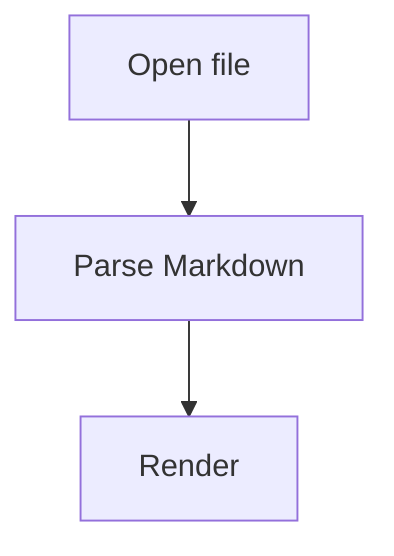

# Test Plan and Fixtures

## Test philosophy

A Markdown reader fails when small edge cases break layout or safety.

Tests need to cover:

1. Markdown parsing correctness.
2. Rendering appearance.
3. Security.
4. Cross-platform file behavior.
5. Performance.
6. DESIGN.md special behavior.

## Automated test types

### Unit tests

- front matter extraction
- token reference resolver
- contrast ratio
- URL policy
- path resolver
- GitHub alert detector
- heading outline generator

### Snapshot tests

- normalized AST snapshots
- rendered HTML snapshots after sanitization
- DESIGN.md lint output snapshots

### Visual regression tests

Use Playwright or equivalent for WebView/frontend snapshots.

Screens:

- desktop light
- desktop dark
- iPhone portrait
- iPad/tablet width
- narrow desktop window

### Security tests

Use malicious fixtures and assert sanitized output.

### Performance tests

Measure parse/render/highlight time for fixture sizes.

## Fixture files to create

### `fixtures/basic-commonmark.md`

Covers:

- headings
- paragraphs
- emphasis
- links
- images
- nested lists
- blockquotes
- thematic breaks
- code spans and fences

### `fixtures/gfm.md`

Covers:

- tables
- task lists
- strikethrough
- autolinks
- footnotes

### `fixtures/github-alerts.md`

```md
> [!NOTE]
> Useful information.

> [!TIP]
> Helpful advice.

> [!IMPORTANT]
> Key information.

> [!WARNING]
> Urgent warning.

> [!CAUTION]
> Risk or negative outcome.
```

### `fixtures/code-heavy.md`

Include many languages:

- js
- ts
- json
- yaml
- bash
- python
- swift
- rust
- diff

### `fixtures/tables-wide.md`

Create a table wider than phone viewport.

Acceptance:

- No page horizontal scroll.
- Table shell scrolls independently.

### `fixtures/mermaid.md`

Valid:



Invalid:

```mermaid
not actually mermaid
```

### `fixtures/math.md`

```md
Inline math: $E = mc^2$

$$
\int_0^1 x^2 dx = \frac{1}{3}
$$
```

### `fixtures/frontmatter.md`

```md
---
title: Test Document
tags: [test, markdown]
---

# Body
```

### `fixtures/design-md-valid.md`

Use a small valid DESIGN.md with colors, typography, spacing, rounded, components.

### `fixtures/design-md-broken.md`

Include:

- broken token reference
- invalid color
- missing typography
- duplicate `## Colors`
- bad contrast component

### `fixtures/xss.md`

Include:

```md
<script>alert(1)</script>


[bad](javascript:alert(1))

<iframe src="https://example.com"></iframe>

<details><summary>Allowed?</summary>Safe details text.</details>
```

Expected:

- scripts removed
- event handlers removed
- bad links disabled
- iframe removed
- details kept only if allowed

### `fixtures/path-traversal.md`

```md


```

Expected:

- normal image loads if in granted folder
- traversal blocked unless explicitly in granted scope

## Manual QA checklist

### Windows

- Open by double-clicking `.md`.
- Drag file onto window.
- Open large file.
- Resize window narrow.
- External link opens browser.
- Recent files works after restart.

### macOS

- Open from Finder.
- File association.
- Dark mode follows system if setting enabled.
- Trackpad scroll and pinch image zoom.
- External links open browser.

### iOS (later target)

- Open from Files.
- Share sheet import.
- Rotate phone.
- Long press link.
- Open image lightbox.
- Reopen recent document after app restart.

## Acceptance gates for v1

- 95% of fixture tests pass.
- No known XSS fixture executes.
- App opens 1MB fixture under target time.
- Basic README looks good on all target platforms.
- DESIGN.md valid fixture shows token gallery.
